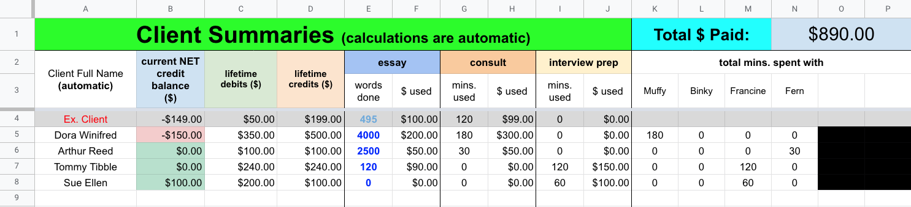

# Bookkeeper
Bookkeeper is a transaction journal for employee-client businesses. 
 Store unlimited entries while automatically updating workforce and client data. The system adheres to standard accounting principles by tracking, closing, and summarizing entries monthly, leaving room for modifications.  
 
The [online version](https://docs.google.com/spreadsheets/d/1qhAUi4EdRdpdfOoJvO20VIdC-DMeTKVQ11Vzio7wQ7A/edit#gid=1469364207) is highly recommended, but you can download a local file [here](https://docs.google.com/spreadsheets/d/e/2PACX-1vRZgM3BlebedB4DLVBP3jAk88BbdJs4YWiBDREDbY7ZTZHkpqHD14TOWPjDzaHh6ZEiYsAUe8Z6fFBV/pub?output=xlsx).

## Features
### Transaction Journal

 

### Monthly-Separated Income Statements

 

### Summary Data per Client

 

### Overall Growth & Trends

 

## Setup

Open the [online sheet](https://docs.google.com/spreadsheets/d/1qhAUi4EdRdpdfOoJvO20VIdC-DMeTKVQ11Vzio7wQ7A/edit#gid=1469364207), find it in your Drive and make a copy.

